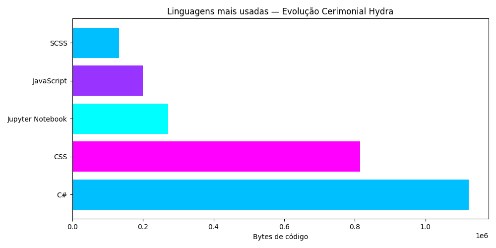
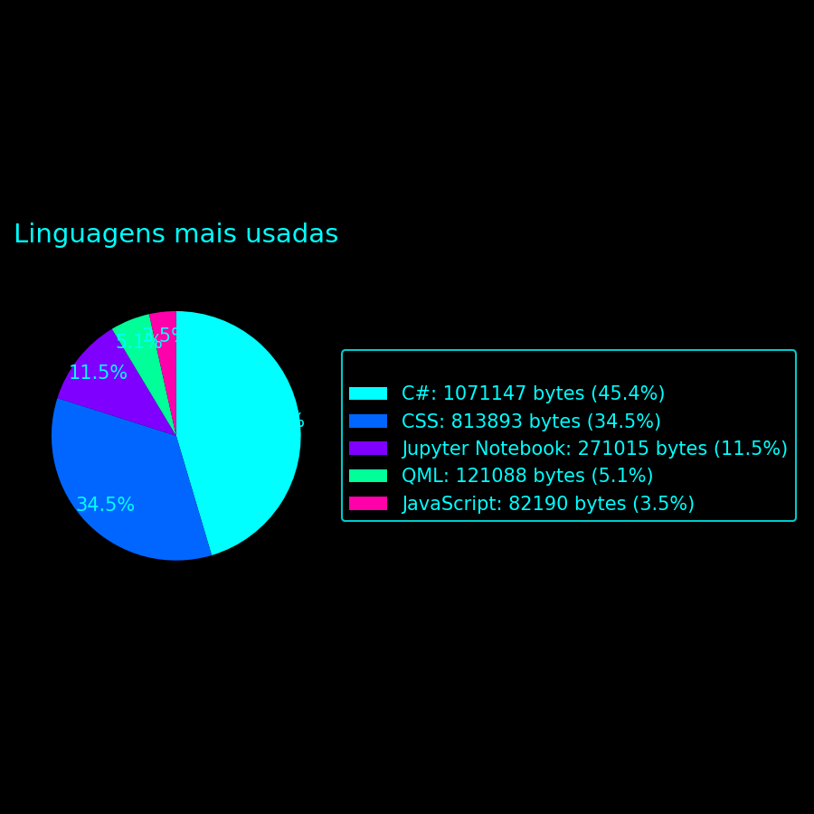
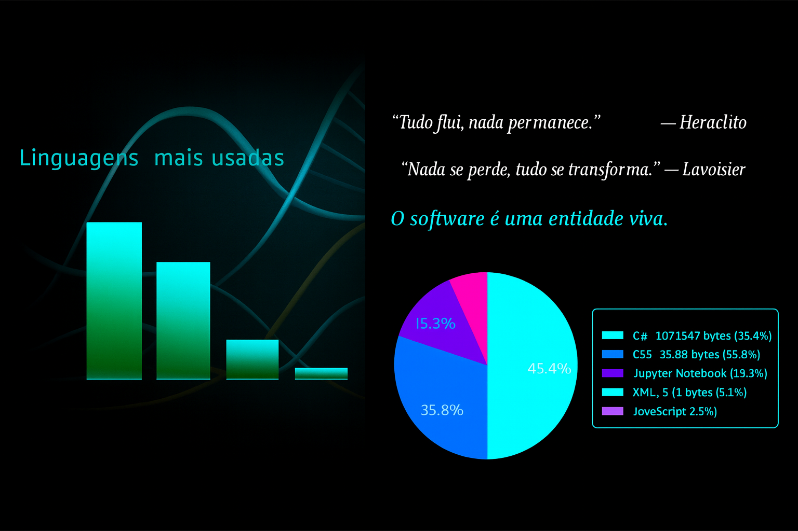
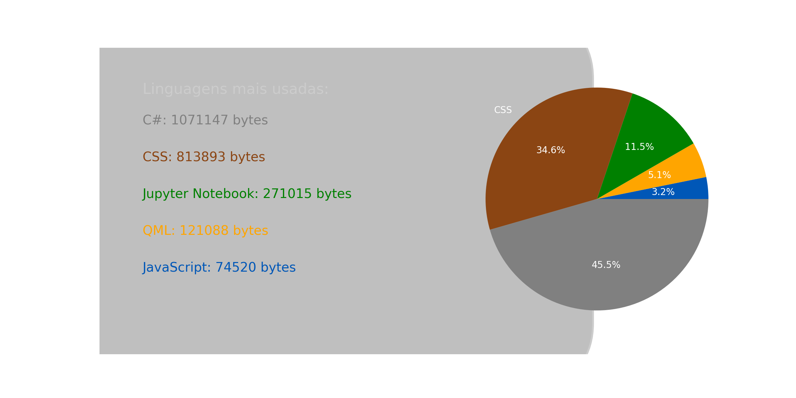

<!-- markdownlint-disable MD032 MD033-->

<!-- Write your README.md file. Build something amazing! This README.md template can guide you to build your project documentation, but feel free to modify it as you wish 🥰 -->

# 🔥 **Hi, My name is Carlos Marques, welcome to my Github profile!**

<div align="center">
  <!-- Change your logo -->
  <a href="https://github.com/carloshmarques/carloshmarques">
    
  </a>
  <br>
  <a href="https://github.com/carloshmarques/carloshmarques/issues">
    
  </a>
  <a href="https://github.com/carloshmarques/carloshmarques/pulls">
    
  </a>
</div>

---

🤔 **About me**

* I'm an aspiring programmer. I am interested in several programming languages, namely, for example:
  Windows Form: Vb.net, C#;
  Web design: Nodejs, Ruby, Jekyll, Gulp, Sass, Js, Jquery, etc.
* I created this profile with the intention of, in addition to publishing achievements and projects, also, if possible, receiving tips from more experienced programmers, in order to progress in my learning and personal development.

🔧 Currently working on: [HydraLife](https://github.com/carloshmarques/HydraLife)

<div style="display: inline-block">

---

## ⚡ **Programming Languages**


---

## 🎒 **Libraries**


---

## ❄️ **Tools & code processors**


</div>

---

<!--HYDRA-CHAMBER-OPEN-->
<table width="100%" style="border:2px solid #00ffff; border-radius:6px;">
<tr>
<td>

</td>

<td style="text-align:left; padding:0 20px;">
<em>“Tudo flui, nada permanece.” — Heraclito</em><br><br>
<em>“Nada se perde, tudo se transforma.” — Lavoisier</em><br><br>
<em><a href="https://github.com/carloshmarques/HydraLife" style="color:#00ffff;">
“O software é uma entidade viva.” — HydraLife</a></em>
</td>
</tr>
</table>
<!--HYDRA-CHAMBER-CLOSE-->

---

<!--LANG-STATS-START-->

<table width="100%" style="border:2px solid #00ffff; border-radius:6px;">
<tr>

<td width="50%" style="vertical-align:top; padding:10px;">
<h3>Linguagens mais usadas (atualizado automaticamente)</h3>
<ul>
<li><strong style="color:#00bfff">C#</strong> — 1071147 bytes de código</li>
<li><strong style="color:#ff00ff">CSS</strong> — 813893 bytes de código</li>
<li><strong style="color:#00ffff">Jupyter Notebook</strong> — 271015 bytes de código</li>
<li><strong style="color:#ffcc00">QML</strong> — 121088 bytes de código</li>
<li><strong style="color:#9933ff">JavaScript</strong> — 91238 bytes de código</li>

</ul>
</td>

<td width="50%" style="text-align:center; padding:10px;">

</td>

</tr>
</table>

<!--LANG-STATS-END-->

---

## 📸 Screenshots
 
<details>
  <summary>Clique para ver as capturas cerimoniais</summary>
  <div align="center"> 
    
    
    
    
    
    
     
  </div>
</details>

---

## 🌿 Estrutura do Projeto

<details>
  <summary>Clique para expandir a árvore...</summary> 

<!--TREE-START-->
```
.
├── assets
│   ├── img
│   ├── js
│   ├── pug
│   └── sass
├── dev
│   ├── css
│   ├── img
│   └── js
├── screenshots
└── scripts

12 directories
```
<!--TREE-END-->
</details>

---

## 🌿 Gulp Workflow

Este projeto usa Gulp para compilar Sass, minificar JS, otimizar imagens e gerar HTML via Pug.

- Sass: `assets/sass/**/*.scss` → `dist/css/`
- Estilo: `expanded` em desenvolvimento, `compressed` em produção
- Ambiente controlado por `NODE_ENV`

Para adaptar ao teu workspace:
- Edita os caminhos no `gulpfile.js`
- Usa `npm run dev` ou `NODE_ENV=production npm run build`

---

## 🍰 **Supporters and donators**

<!-- Change your small logo -->

<a href="https://github.com/carloshmarques/carloshmarques">
  
</a>
<p>We are currently looking for new donators to help and maintain this project of personal development! ❤️
By donating, you will help the development of this project, and *you will be featured in this <span style="color:darkolivegreen;font-weight:bold">carloshmarques's README.md*</span>, so everyone can see your kindness and visit your content ⭐.</p>
<a href="https://github.com/sponsors/carloshmarques"><!-- MODIFY THIS LINK TO YOUR MAIN DONATING SITE IF YOU ARE NOT IN THE GITHUB SPONSORS PROGRAM --></a><br><br>

<!-- LINK TO YOUR DONATING PAGES HERE -->
---

# 🕵️ Social Media & Mailing
<!-- If you recommend installing anything special, or if you recommend using X thing for the good use of your project...-->
## This is my usual social media links at the moment

<p align="left"><a href="https://www.linkedin.com/in/carlos-marques-92b2b4183/" target="_blank" rel="noopener noreferrer"></a><a href="https://independent.academia.edu/CarlosMarques223" target="_blank" rel="noopener noreferrer"></a><a href="https://www.facebook.com/hydraprojects/" target="_blank" rel="noopener noreferrer"></a><a href="https://www.youtube.com/channel/UCYI5IR2pNZ8pJn9RuJiUjAQ" target="_blank" rel="noopener noreferrer"><a href="https://carlosmanuelhortam.wixsite.com/hydraprojects" target="_blank" rel="noopener noreferrer"></a></p><br>

### contact me via email

<p align="left">
<a href="mailto:carlos.manuel.horta.marques@gmail.com" target="_blank" rel="noopener noreferrer"></a><a href="https://carlosmanuelhortam.wixsite.com/hydraprojects/contato" target="_blank" rel="noopener noreferrer"></a></p><br><br>

---

## 🎞️ You Tube Channel

<!-- BEGIN YOUTUBE-CARDS -->
[](https://www.youtube.com/watch?v=RSdRh2PESvg)
<!-- END YOUTUBE-CARDS -->

---

## 📰 What's new

<!-- BLOG-POST-LIST:START -->
- [HydraLifeOS](https://carlosmhm.wixsite.com/lifeciclehub/post/hydralifeos)
- [Learning Gulpjs](https://carlosmhm.wixsite.com/lifeciclehub/post/aprendendo-linguagem-de-c%C3%B3digo-gulp-js)
- [Património gastronómico, natural, cultural artesanal e arquitetónico da região de Aveiro, Parte 1](https://carlosmhm.wixsite.com/lifeciclehub/post/patrim%C3%B3nio-gastron%C3%B3mico-natural-cultural-artesanal-e-arquitet%C3%B3nico-da-regi%C3%A3o-de-aveiro-parte-1)
- [Como limpar cache do seu computador, com ficheiro CMD](https://carlosmhm.wixsite.com/lifeciclehub/post/como-limpar-cache-do-seu-computar-com-ficheiro-cmd)
<!-- BLOG-POST-LIST:END -->

---

## 🎉 Was the "Github Profile" helpful? Help us raise these numbers up

<div style="display: inline-block"><br>

[](https://github.com/carloshmarques)
[](https://github.com/carloshmarques/carloshmarques/stargazers)
[](https://github.com/carloshmarques/carloshmarques/watchers)
[](https://github.com/carloshmarques/carloshmarques/network/members)

<!-- MODIFY THIS LINK TO YOUR MAIN DONATING SITE IF YOU ARE NOT IN THE GITHUB SPONSORS PROGRAM -->

[](https://github.com/sponsors/carloshmarques)

Enjoy! 😃

<div>

## ⚖️📝 **License and Changelog**

See the license in the '**[LICENSE](LICENSE)**' file.

Watch the changes in the '**[CHANGELOG.md](CHANGELOG.md)**' file.

---

## 📝 **Additional notes**

* Thanks to <a href="https://www.youtube.com/@rafaellaballerini" target="_blank" rel="noopener noreferrer" >Rafaella Ballerini<a>

<p>Thanks for the tips on how to make the profile, the links to the icons and everything else, although I created the profile from a template, it helped me a lot to start the profile.</p>

<!-- ... [ADD ADDITIONAL NOTES] -->

**Made with a lot of ❤️❤️ by **[@carloshmarques](https://github.com/carloshmarques)**

---

# carloshmarques was generated from *[Josee9988/project-template](https://github.com/Josee9988/project-template)* 📚


```
carloshmarques
├─ .babelrc
├─ assets
│  ├─ img
│  │  ├─ icons
│  │  │  ├─ burger
│  │  │  │  ├─ bars-solid.svg
│  │  │  │  └─ xmark-solid.svg
│  │  │  └─ default
│  │  │     ├─ folder-solid.svg
│  │  │     ├─ gear-solid.svg
│  │  │     ├─ magnifying-glass-solid.svg
│  │  │     ├─ rocket-solid.svg
│  │  │     ├─ terminal-solid.svg
│  │  │     └─ user-solid.svg
│  │  ├─ nav
│  │  │  ├─ circle-info-solid.svg
│  │  │  ├─ code-solid.svg
│  │  │  ├─ envelope-solid.svg
│  │  │  ├─ house-solid.svg
│  │  │  ├─ newspaper-solid.svg
│  │  │  ├─ palette-solid.svg
│  │  │  ├─ star-solid.svg
│  │  │  └─ user-shield-solid.svg
│  │  ├─ social
│  │  │  ├─ disqus-brands-solid.svg
│  │  │  ├─ facebook-brands-solid.svg
│  │  │  ├─ github-brands-solid.svg
│  │  │  ├─ instagram-brands-solid.svg
│  │  │  ├─ linkedin-brands-solid.svg
│  │  │  ├─ tiktok-brands-solid.svg
│  │  │  ├─ twitter-brands-solid.svg
│  │  │  └─ youtube-brands-solid-full.svg
│  │  ├─ themes
│  │  │  ├─ dark-bg.jpg
│  │  │  ├─ dracula-bg.jpg
│  │  │  ├─ hydra-bg.jpg
│  │  │  ├─ light-bg.jpg
│  │  │  ├─ neon-bg.jpg
│  │  │  └─ solarized-bg.jpg
│  │  └─ ui
│  │     ├─ arrow-down-solid.svg
│  │     ├─ arrow-right-solid.svg
│  │     ├─ bolt-solid.svg
│  │     ├─ chevron-down-solid.svg
│  │     ├─ chevron-right-solid.svg
│  │     ├─ circle-check-solid.svg
│  │     ├─ info-solid.svg
│  │     └─ rocket-solid.svg
│  ├─ js
│  │  ├─ dom.js
│  │  ├─ main.js
│  │  ├─ modules
│  │  │  ├─ animation.js
│  │  │  ├─ app.js
│  │  │  ├─ core.js
│  │  │  ├─ events.js
│  │  │  ├─ logger.js
│  │  │  ├─ navigation.js
│  │  │  └─ portfolio.js
│  │  ├─ theme.js
│  │  └─ utils.js
│  ├─ pug
│  │  └─ templates
│  │     ├─ contents
│  │     │  ├─ features
│  │     │  │  ├─ features-content.pug
│  │     │  │  └─ sections
│  │     │  │     ├─ section-body.pug
│  │     │  │     └─ section-features.pug
│  │     │  └─ index
│  │     │     ├─ index-content.pug
│  │     │     └─ sections
│  │     │        ├─ section-body.pug
│  │     │        └─ section-hero.pug
│  │     ├─ pages
│  │     │  ├─ about.pug
│  │     │  ├─ admin.pug
│  │     │  ├─ contact.pug
│  │     │  ├─ features.pug
│  │     │  ├─ index.pug
│  │     │  ├─ news.pug
│  │     │  ├─ projects.pug
│  │     │  └─ themes.pug
│  │     └─ sections
│  │        ├─ body.pug
│  │        ├─ footer.pug
│  │        ├─ header.pug
│  │        ├─ layout.pug
│  │        └─ test.pug
│  └─ sass
│     ├─ animations
│     │  └─ _animations.scss
│     ├─ components
│     │  ├─ _about.scss
│     │  ├─ _contact.scss
│     │  ├─ _features.scss
│     │  ├─ _footer.scss
│     │  ├─ _home.scss
│     │  ├─ _logo.scss
│     │  ├─ _menu.scss
│     │  ├─ _news.scss
│     │  └─ _projects.scss
│     ├─ main.scss
│     ├─ modules
│     │  ├─ _breakpoints.scss
│     │  ├─ _buttons.scss
│     │  ├─ _colors.scss
│     │  ├─ _config.scss
│     │  ├─ _functions.scss
│     │  ├─ _heal.scss
│     │  ├─ _index.scss
│     │  ├─ _layout.scss
│     │  ├─ _mixins.scss
│     │  ├─ _reset.scss
│     │  ├─ _responsive.scss
│     │  ├─ _shadows.scss
│     │  ├─ _spacing.scss
│     │  ├─ _themes.scss
│     │  ├─ _typography.scss
│     │  └─ _variables.scss
│     └─ normalize.scss
├─ CHANGELOG.md
├─ dev
│  ├─ about.html
│  ├─ admin.html
│  ├─ contact.html
│  ├─ css
│  │  ├─ main.css
│  │  ├─ main.css.map
│  │  ├─ normalize.css
│  │  └─ normalize.css.map
│  ├─ features.html
│  ├─ img
│  │  ├─ icons
│  │  │  ├─ burger
│  │  │  │  ├─ bars-solid.svg
│  │  │  │  └─ xmark-solid.svg
│  │  │  └─ default
│  │  │     ├─ folder-solid.svg
│  │  │     ├─ gear-solid.svg
│  │  │     ├─ magnifying-glass-solid.svg
│  │  │     ├─ rocket-solid.svg
│  │  │     ├─ terminal-solid.svg
│  │  │     └─ user-solid.svg
│  │  ├─ nav
│  │  │  ├─ circle-info-solid.svg
│  │  │  ├─ code-solid.svg
│  │  │  ├─ envelope-solid.svg
│  │  │  ├─ house-solid.svg
│  │  │  ├─ newspaper-solid.svg
│  │  │  ├─ palette-solid.svg
│  │  │  ├─ star-solid.svg
│  │  │  └─ user-shield-solid.svg
│  │  ├─ social
│  │  │  ├─ disqus-brands-solid.svg
│  │  │  ├─ facebook-brands-solid.svg
│  │  │  ├─ github-brands-solid.svg
│  │  │  ├─ instagram-brands-solid.svg
│  │  │  ├─ linkedin-brands-solid.svg
│  │  │  ├─ tiktok-brands-solid.svg
│  │  │  ├─ twitter-brands-solid.svg
│  │  │  └─ youtube-brands-solid-full.svg
│  │  ├─ themes
│  │  │  ├─ dark-bg.jpg
│  │  │  ├─ dracula-bg.jpg
│  │  │  ├─ hydra-bg.jpg
│  │  │  ├─ kennedy.jpg
│  │  │  ├─ light-bg.jpg
│  │  │  ├─ neon-bg.jpg
│  │  │  └─ solarized-bg.jpg
│  │  └─ ui
│  │     ├─ arrow-down-solid.svg
│  │     ├─ arrow-right-solid.svg
│  │     ├─ bolt-solid.svg
│  │     ├─ chevron-down-solid.svg
│  │     ├─ chevron-right-solid.svg
│  │     ├─ circle-check-solid.svg
│  │     ├─ info-solid.svg
│  │     └─ rocket-solid.svg
│  ├─ index.html
│  ├─ js
│  │  ├─ main.js
│  │  └─ main.js.map
│  ├─ news.html
│  ├─ projects.html
│  ├─ test.html
│  └─ themes.html
├─ gulpfile.cjs
├─ LICENSE
├─ package-lock.json
├─ package.json
├─ README.md
├─ screenshots
│  ├─ evolucao_linguagens.png
│  ├─ fundo_adn.png
│  ├─ kennedy.jpg
│  ├─ language_pie.png
│  ├─ language_stats.png
│  └─ painel_mutacao.png
├─ scripts
│  ├─ generate_language_image.py
│  ├─ generate_language_pie.py
│  ├─ update_changelog.py
│  ├─ update_stats.py
│  └─ update_tree.py
├─ stats-lock.json
└─ stats.json

```
```
carloshmarques
├─ .babelrc
├─ assets
│  ├─ img
│  │  ├─ icons
│  │  │  ├─ burger
│  │  │  │  ├─ bars-solid.svg
│  │  │  │  └─ xmark-solid.svg
│  │  │  └─ default
│  │  │     ├─ folder-solid.svg
│  │  │     ├─ gear-solid.svg
│  │  │     ├─ magnifying-glass-solid.svg
│  │  │     ├─ rocket-solid.svg
│  │  │     ├─ terminal-solid.svg
│  │  │     └─ user-solid.svg
│  │  ├─ nav
│  │  │  ├─ circle-info-solid.svg
│  │  │  ├─ code-solid.svg
│  │  │  ├─ envelope-solid.svg
│  │  │  ├─ house-solid.svg
│  │  │  ├─ newspaper-solid.svg
│  │  │  ├─ palette-solid.svg
│  │  │  ├─ star-solid.svg
│  │  │  └─ user-shield-solid.svg
│  │  ├─ social
│  │  │  ├─ disqus-brands-solid.svg
│  │  │  ├─ facebook-brands-solid.svg
│  │  │  ├─ github-brands-solid.svg
│  │  │  ├─ instagram-brands-solid.svg
│  │  │  ├─ linkedin-brands-solid.svg
│  │  │  ├─ tiktok-brands-solid.svg
│  │  │  ├─ twitter-brands-solid.svg
│  │  │  └─ youtube-brands-solid-full.svg
│  │  ├─ themes
│  │  │  ├─ dark-bg.jpg
│  │  │  ├─ dracula-bg.jpg
│  │  │  ├─ hydra-bg.jpg
│  │  │  ├─ light-bg.jpg
│  │  │  ├─ neon-bg.jpg
│  │  │  └─ solarized-bg.jpg
│  │  └─ ui
│  │     ├─ arrow-down-solid.svg
│  │     ├─ arrow-right-solid.svg
│  │     ├─ bolt-solid.svg
│  │     ├─ chevron-down-solid.svg
│  │     ├─ chevron-right-solid.svg
│  │     ├─ circle-check-solid.svg
│  │     ├─ info-solid.svg
│  │     └─ rocket-solid.svg
│  ├─ js
│  │  ├─ dom.js
│  │  ├─ main.js
│  │  ├─ modules
│  │  │  ├─ animation.js
│  │  │  ├─ app.js
│  │  │  ├─ core.js
│  │  │  ├─ events.js
│  │  │  ├─ logger.js
│  │  │  ├─ navigation.js
│  │  │  └─ portfolio.js
│  │  ├─ theme.js
│  │  └─ utils.js
│  ├─ pug
│  │  └─ templates
│  │     ├─ contents
│  │     │  ├─ features
│  │     │  │  ├─ features-content.pug
│  │     │  │  └─ sections
│  │     │  │     ├─ section-body.pug
│  │     │  │     └─ section-features.pug
│  │     │  └─ index
│  │     │     ├─ index-content.pug
│  │     │     └─ sections
│  │     │        ├─ section-body.pug
│  │     │        └─ section-hero.pug
│  │     ├─ pages
│  │     │  ├─ about.pug
│  │     │  ├─ admin.pug
│  │     │  ├─ contact.pug
│  │     │  ├─ features.pug
│  │     │  ├─ index.pug
│  │     │  ├─ news.pug
│  │     │  ├─ projects.pug
│  │     │  └─ themes.pug
│  │     └─ sections
│  │        ├─ body.pug
│  │        ├─ footer.pug
│  │        ├─ header.pug
│  │        ├─ layout.pug
│  │        └─ test.pug
│  └─ sass
│     ├─ animations
│     │  └─ _animations.scss
│     ├─ components
│     │  ├─ _about.scss
│     │  ├─ _contact.scss
│     │  ├─ _features.scss
│     │  ├─ _footer.scss
│     │  ├─ _home.scss
│     │  ├─ _logo.scss
│     │  ├─ _menu.scss
│     │  ├─ _news.scss
│     │  └─ _projects.scss
│     ├─ main.scss
│     ├─ modules
│     │  ├─ _breakpoints.scss
│     │  ├─ _buttons.scss
│     │  ├─ _colors.scss
│     │  ├─ _config.scss
│     │  ├─ _functions.scss
│     │  ├─ _heal.scss
│     │  ├─ _index.scss
│     │  ├─ _layout.scss
│     │  ├─ _mixins.scss
│     │  ├─ _reset.scss
│     │  ├─ _responsive.scss
│     │  ├─ _shadows.scss
│     │  ├─ _spacing.scss
│     │  ├─ _themes.scss
│     │  ├─ _typography.scss
│     │  └─ _variables.scss
│     └─ normalize.scss
├─ CHANGELOG.md
├─ dev
│  ├─ about.html
│  ├─ admin.html
│  ├─ contact.html
│  ├─ css
│  │  ├─ main.css
│  │  ├─ main.css.map
│  │  ├─ normalize.css
│  │  └─ normalize.css.map
│  ├─ features.html
│  ├─ img
│  │  ├─ icons
│  │  │  ├─ burger
│  │  │  │  ├─ bars-solid.svg
│  │  │  │  └─ xmark-solid.svg
│  │  │  └─ default
│  │  │     ├─ folder-solid.svg
│  │  │     ├─ gear-solid.svg
│  │  │     ├─ magnifying-glass-solid.svg
│  │  │     ├─ rocket-solid.svg
│  │  │     ├─ terminal-solid.svg
│  │  │     └─ user-solid.svg
│  │  ├─ nav
│  │  │  ├─ circle-info-solid.svg
│  │  │  ├─ code-solid.svg
│  │  │  ├─ envelope-solid.svg
│  │  │  ├─ house-solid.svg
│  │  │  ├─ newspaper-solid.svg
│  │  │  ├─ palette-solid.svg
│  │  │  ├─ star-solid.svg
│  │  │  └─ user-shield-solid.svg
│  │  ├─ social
│  │  │  ├─ disqus-brands-solid.svg
│  │  │  ├─ facebook-brands-solid.svg
│  │  │  ├─ github-brands-solid.svg
│  │  │  ├─ instagram-brands-solid.svg
│  │  │  ├─ linkedin-brands-solid.svg
│  │  │  ├─ tiktok-brands-solid.svg
│  │  │  ├─ twitter-brands-solid.svg
│  │  │  └─ youtube-brands-solid-full.svg
│  │  ├─ themes
│  │  │  ├─ dark-bg.jpg
│  │  │  ├─ dracula-bg.jpg
│  │  │  ├─ hydra-bg.jpg
│  │  │  ├─ kennedy.jpg
│  │  │  ├─ light-bg.jpg
│  │  │  ├─ neon-bg.jpg
│  │  │  └─ solarized-bg.jpg
│  │  └─ ui
│  │     ├─ arrow-down-solid.svg
│  │     ├─ arrow-right-solid.svg
│  │     ├─ bolt-solid.svg
│  │     ├─ chevron-down-solid.svg
│  │     ├─ chevron-right-solid.svg
│  │     ├─ circle-check-solid.svg
│  │     ├─ info-solid.svg
│  │     └─ rocket-solid.svg
│  ├─ index.html
│  ├─ js
│  │  ├─ main.js
│  │  └─ main.js.map
│  ├─ news.html
│  ├─ projects.html
│  ├─ test.html
│  └─ themes.html
├─ gulpfile.cjs
├─ LICENSE
├─ package-lock.json
├─ package.json
├─ README.md
├─ screenshots
│  ├─ evolucao_linguagens.png
│  ├─ fundo_adn.png
│  ├─ kennedy.jpg
│  ├─ language_pie.png
│  ├─ language_stats.png
│  └─ painel_mutacao.png
├─ scripts
│  ├─ generate_language_image.py
│  ├─ generate_language_pie.py
│  ├─ update_changelog.py
│  ├─ update_stats.py
│  └─ update_tree.py
├─ stats-lock.json
└─ stats.json

```
```
carloshmarques
├─ .babelrc
├─ assets
│  ├─ img
│  │  ├─ icons
│  │  │  ├─ burger
│  │  │  │  ├─ bars-solid.svg
│  │  │  │  └─ xmark-solid.svg
│  │  │  └─ default
│  │  │     ├─ folder-solid.svg
│  │  │     ├─ gear-solid.svg
│  │  │     ├─ magnifying-glass-solid.svg
│  │  │     ├─ rocket-solid.svg
│  │  │     ├─ terminal-solid.svg
│  │  │     └─ user-solid.svg
│  │  ├─ nav
│  │  │  ├─ circle-info-solid.svg
│  │  │  ├─ code-solid.svg
│  │  │  ├─ envelope-solid.svg
│  │  │  ├─ house-solid.svg
│  │  │  ├─ newspaper-solid.svg
│  │  │  ├─ palette-solid.svg
│  │  │  ├─ star-solid.svg
│  │  │  └─ user-shield-solid.svg
│  │  ├─ social
│  │  │  ├─ disqus-brands-solid.svg
│  │  │  ├─ facebook-brands-solid.svg
│  │  │  ├─ github-brands-solid.svg
│  │  │  ├─ instagram-brands-solid.svg
│  │  │  ├─ linkedin-brands-solid.svg
│  │  │  ├─ tiktok-brands-solid.svg
│  │  │  ├─ twitter-brands-solid.svg
│  │  │  └─ youtube-brands-solid-full.svg
│  │  ├─ themes
│  │  │  ├─ dark-bg.jpg
│  │  │  ├─ dracula-bg.jpg
│  │  │  ├─ hydra-bg.jpg
│  │  │  ├─ light-bg.jpg
│  │  │  ├─ neon-bg.jpg
│  │  │  └─ solarized-bg.jpg
│  │  └─ ui
│  │     ├─ arrow-down-solid.svg
│  │     ├─ arrow-right-solid.svg
│  │     ├─ bolt-solid.svg
│  │     ├─ chevron-down-solid.svg
│  │     ├─ chevron-right-solid.svg
│  │     ├─ circle-check-solid.svg
│  │     ├─ info-solid.svg
│  │     └─ rocket-solid.svg
│  ├─ js
│  │  ├─ dom.js
│  │  ├─ main.js
│  │  ├─ modules
│  │  │  ├─ animation.js
│  │  │  ├─ app.js
│  │  │  ├─ core.js
│  │  │  ├─ events.js
│  │  │  ├─ logger.js
│  │  │  ├─ navigation.js
│  │  │  └─ portfolio.js
│  │  ├─ theme.js
│  │  └─ utils.js
│  ├─ pug
│  │  └─ templates
│  │     ├─ contents
│  │     │  ├─ features
│  │     │  │  ├─ features-content.pug
│  │     │  │  └─ sections
│  │     │  │     ├─ section-body.pug
│  │     │  │     └─ section-features.pug
│  │     │  └─ index
│  │     │     ├─ index-content.pug
│  │     │     └─ sections
│  │     │        ├─ section-body.pug
│  │     │        └─ section-hero.pug
│  │     ├─ pages
│  │     │  ├─ about.pug
│  │     │  ├─ admin.pug
│  │     │  ├─ contact.pug
│  │     │  ├─ features.pug
│  │     │  ├─ index.pug
│  │     │  ├─ news.pug
│  │     │  ├─ projects.pug
│  │     │  └─ themes.pug
│  │     └─ sections
│  │        ├─ body.pug
│  │        ├─ footer.pug
│  │        ├─ header.pug
│  │        ├─ layout.pug
│  │        └─ test.pug
│  └─ sass
│     ├─ animations
│     │  └─ _animations.scss
│     ├─ components
│     │  ├─ _about.scss
│     │  ├─ _contact.scss
│     │  ├─ _features.scss
│     │  ├─ _footer.scss
│     │  ├─ _home.scss
│     │  ├─ _logo.scss
│     │  ├─ _menu.scss
│     │  ├─ _news.scss
│     │  └─ _projects.scss
│     ├─ main.scss
│     ├─ modules
│     │  ├─ _breakpoints.scss
│     │  ├─ _buttons.scss
│     │  ├─ _colors.scss
│     │  ├─ _config.scss
│     │  ├─ _functions.scss
│     │  ├─ _heal.scss
│     │  ├─ _index.scss
│     │  ├─ _layout.scss
│     │  ├─ _mixins.scss
│     │  ├─ _reset.scss
│     │  ├─ _responsive.scss
│     │  ├─ _shadows.scss
│     │  ├─ _spacing.scss
│     │  ├─ _themes.scss
│     │  ├─ _typography.scss
│     │  └─ _variables.scss
│     └─ normalize.scss
├─ CHANGELOG.md
├─ dev
│  ├─ about.html
│  ├─ admin.html
│  ├─ contact.html
│  ├─ css
│  │  ├─ main.css
│  │  ├─ main.css.map
│  │  ├─ normalize.css
│  │  └─ normalize.css.map
│  ├─ features.html
│  ├─ img
│  │  ├─ icons
│  │  │  ├─ burger
│  │  │  │  ├─ bars-solid.svg
│  │  │  │  └─ xmark-solid.svg
│  │  │  └─ default
│  │  │     ├─ folder-solid.svg
│  │  │     ├─ gear-solid.svg
│  │  │     ├─ magnifying-glass-solid.svg
│  │  │     ├─ rocket-solid.svg
│  │  │     ├─ terminal-solid.svg
│  │  │     └─ user-solid.svg
│  │  ├─ nav
│  │  │  ├─ circle-info-solid.svg
│  │  │  ├─ code-solid.svg
│  │  │  ├─ envelope-solid.svg
│  │  │  ├─ house-solid.svg
│  │  │  ├─ newspaper-solid.svg
│  │  │  ├─ palette-solid.svg
│  │  │  ├─ star-solid.svg
│  │  │  └─ user-shield-solid.svg
│  │  ├─ social
│  │  │  ├─ disqus-brands-solid.svg
│  │  │  ├─ facebook-brands-solid.svg
│  │  │  ├─ github-brands-solid.svg
│  │  │  ├─ instagram-brands-solid.svg
│  │  │  ├─ linkedin-brands-solid.svg
│  │  │  ├─ tiktok-brands-solid.svg
│  │  │  ├─ twitter-brands-solid.svg
│  │  │  └─ youtube-brands-solid-full.svg
│  │  ├─ themes
│  │  │  ├─ dark-bg.jpg
│  │  │  ├─ dracula-bg.jpg
│  │  │  ├─ hydra-bg.jpg
│  │  │  ├─ kennedy.jpg
│  │  │  ├─ light-bg.jpg
│  │  │  ├─ neon-bg.jpg
│  │  │  └─ solarized-bg.jpg
│  │  └─ ui
│  │     ├─ arrow-down-solid.svg
│  │     ├─ arrow-right-solid.svg
│  │     ├─ bolt-solid.svg
│  │     ├─ chevron-down-solid.svg
│  │     ├─ chevron-right-solid.svg
│  │     ├─ circle-check-solid.svg
│  │     ├─ info-solid.svg
│  │     └─ rocket-solid.svg
│  ├─ index.html
│  ├─ js
│  │  ├─ main.js
│  │  └─ main.js.map
│  ├─ news.html
│  ├─ projects.html
│  ├─ test.html
│  └─ themes.html
├─ gulpfile.cjs
├─ LICENSE
├─ package-lock.json
├─ package.json
├─ README.md
├─ screenshots
│  ├─ evolucao_linguagens.png
│  ├─ fundo_adn.png
│  ├─ kennedy.jpg
│  ├─ language_pie.png
│  ├─ language_stats.png
│  └─ painel_mutacao.png
├─ scripts
│  ├─ generate_language_image.py
│  ├─ generate_language_pie.py
│  ├─ update_changelog.py
│  ├─ update_stats.py
│  └─ update_tree.py
├─ stats-lock.json
└─ stats.json

```
```
carloshmarques
├─ .babelrc
├─ assets
│  ├─ img
│  │  ├─ icons
│  │  │  ├─ burger
│  │  │  │  ├─ bars-solid.svg
│  │  │  │  └─ xmark-solid.svg
│  │  │  └─ default
│  │  │     ├─ folder-solid.svg
│  │  │     ├─ gear-solid.svg
│  │  │     ├─ magnifying-glass-solid.svg
│  │  │     ├─ rocket-solid.svg
│  │  │     ├─ terminal-solid.svg
│  │  │     └─ user-solid.svg
│  │  ├─ nav
│  │  │  ├─ circle-info-solid.svg
│  │  │  ├─ code-solid.svg
│  │  │  ├─ envelope-solid.svg
│  │  │  ├─ house-solid.svg
│  │  │  ├─ newspaper-solid.svg
│  │  │  ├─ palette-solid.svg
│  │  │  ├─ star-solid.svg
│  │  │  └─ user-shield-solid.svg
│  │  ├─ social
│  │  │  ├─ disqus-brands-solid.svg
│  │  │  ├─ facebook-brands-solid.svg
│  │  │  ├─ github-brands-solid.svg
│  │  │  ├─ instagram-brands-solid.svg
│  │  │  ├─ linkedin-brands-solid.svg
│  │  │  ├─ tiktok-brands-solid.svg
│  │  │  ├─ twitter-brands-solid.svg
│  │  │  └─ youtube-brands-solid-full.svg
│  │  ├─ themes
│  │  │  ├─ dark-bg.jpg
│  │  │  ├─ dracula-bg.jpg
│  │  │  ├─ hydra-bg.jpg
│  │  │  ├─ light-bg.jpg
│  │  │  ├─ neon-bg.jpg
│  │  │  └─ solarized-bg.jpg
│  │  └─ ui
│  │     ├─ arrow-down-solid.svg
│  │     ├─ arrow-right-solid.svg
│  │     ├─ bolt-solid.svg
│  │     ├─ chevron-down-solid.svg
│  │     ├─ chevron-right-solid.svg
│  │     ├─ circle-check-solid.svg
│  │     ├─ info-solid.svg
│  │     └─ rocket-solid.svg
│  ├─ js
│  │  ├─ dom.js
│  │  ├─ main.js
│  │  ├─ modules
│  │  │  ├─ animation.js
│  │  │  ├─ app.js
│  │  │  ├─ core.js
│  │  │  ├─ events.js
│  │  │  ├─ logger.js
│  │  │  ├─ navigation.js
│  │  │  └─ portfolio.js
│  │  ├─ theme.js
│  │  └─ utils.js
│  ├─ pug
│  │  └─ templates
│  │     ├─ contents
│  │     │  ├─ features
│  │     │  │  ├─ features-content.pug
│  │     │  │  └─ sections
│  │     │  │     ├─ section-body.pug
│  │     │  │     └─ section-features.pug
│  │     │  └─ index
│  │     │     ├─ index-content.pug
│  │     │     └─ sections
│  │     │        ├─ section-body.pug
│  │     │        └─ section-hero.pug
│  │     ├─ pages
│  │     │  ├─ about.pug
│  │     │  ├─ admin.pug
│  │     │  ├─ contact.pug
│  │     │  ├─ features.pug
│  │     │  ├─ index.pug
│  │     │  ├─ news.pug
│  │     │  ├─ projects.pug
│  │     │  └─ themes.pug
│  │     └─ sections
│  │        ├─ body.pug
│  │        ├─ footer.pug
│  │        ├─ header.pug
│  │        ├─ layout.pug
│  │        └─ test.pug
│  └─ sass
│     ├─ animations
│     │  └─ _animations.scss
│     ├─ components
│     │  ├─ _about.scss
│     │  ├─ _contact.scss
│     │  ├─ _features.scss
│     │  ├─ _footer.scss
│     │  ├─ _home.scss
│     │  ├─ _logo.scss
│     │  ├─ _menu.scss
│     │  ├─ _news.scss
│     │  └─ _projects.scss
│     ├─ main.scss
│     ├─ modules
│     │  ├─ _breakpoints.scss
│     │  ├─ _buttons.scss
│     │  ├─ _colors.scss
│     │  ├─ _config.scss
│     │  ├─ _functions.scss
│     │  ├─ _heal.scss
│     │  ├─ _index.scss
│     │  ├─ _layout.scss
│     │  ├─ _mixins.scss
│     │  ├─ _reset.scss
│     │  ├─ _responsive.scss
│     │  ├─ _shadows.scss
│     │  ├─ _spacing.scss
│     │  ├─ _themes.scss
│     │  ├─ _typography.scss
│     │  └─ _variables.scss
│     └─ normalize.scss
├─ CHANGELOG.md
├─ dev
│  ├─ about.html
│  ├─ admin.html
│  ├─ contact.html
│  ├─ css
│  │  ├─ main.css
│  │  ├─ main.css.map
│  │  ├─ normalize.css
│  │  └─ normalize.css.map
│  ├─ features.html
│  ├─ img
│  │  ├─ icons
│  │  │  ├─ burger
│  │  │  │  ├─ bars-solid.svg
│  │  │  │  └─ xmark-solid.svg
│  │  │  └─ default
│  │  │     ├─ folder-solid.svg
│  │  │     ├─ gear-solid.svg
│  │  │     ├─ magnifying-glass-solid.svg
│  │  │     ├─ rocket-solid.svg
│  │  │     ├─ terminal-solid.svg
│  │  │     └─ user-solid.svg
│  │  ├─ nav
│  │  │  ├─ circle-info-solid.svg
│  │  │  ├─ code-solid.svg
│  │  │  ├─ envelope-solid.svg
│  │  │  ├─ house-solid.svg
│  │  │  ├─ newspaper-solid.svg
│  │  │  ├─ palette-solid.svg
│  │  │  ├─ star-solid.svg
│  │  │  └─ user-shield-solid.svg
│  │  ├─ social
│  │  │  ├─ disqus-brands-solid.svg
│  │  │  ├─ facebook-brands-solid.svg
│  │  │  ├─ github-brands-solid.svg
│  │  │  ├─ instagram-brands-solid.svg
│  │  │  ├─ linkedin-brands-solid.svg
│  │  │  ├─ tiktok-brands-solid.svg
│  │  │  ├─ twitter-brands-solid.svg
│  │  │  └─ youtube-brands-solid-full.svg
│  │  ├─ themes
│  │  │  ├─ dark-bg.jpg
│  │  │  ├─ dracula-bg.jpg
│  │  │  ├─ hydra-bg.jpg
│  │  │  ├─ kennedy.jpg
│  │  │  ├─ light-bg.jpg
│  │  │  ├─ neon-bg.jpg
│  │  │  └─ solarized-bg.jpg
│  │  └─ ui
│  │     ├─ arrow-down-solid.svg
│  │     ├─ arrow-right-solid.svg
│  │     ├─ bolt-solid.svg
│  │     ├─ chevron-down-solid.svg
│  │     ├─ chevron-right-solid.svg
│  │     ├─ circle-check-solid.svg
│  │     ├─ info-solid.svg
│  │     └─ rocket-solid.svg
│  ├─ index.html
│  ├─ js
│  │  ├─ main.js
│  │  └─ main.js.map
│  ├─ news.html
│  ├─ projects.html
│  ├─ test.html
│  └─ themes.html
├─ gulpfile.cjs
├─ LICENSE
├─ package-lock.json
├─ package.json
├─ README.md
├─ screenshots
│  ├─ evolucao_linguagens.png
│  ├─ fundo_adn.png
│  ├─ kennedy.jpg
│  ├─ language_pie.png
│  ├─ language_stats.png
│  └─ painel_mutacao.png
├─ scripts
│  ├─ generate_language_image.py
│  ├─ generate_language_pie.py
│  ├─ update_changelog.py
│  ├─ update_stats.py
│  └─ update_tree.py
├─ stats-lock.json
└─ stats.json

```
```
carloshmarques
├─ .babelrc
├─ assets
│  ├─ img
│  │  ├─ icons
│  │  │  ├─ burger
│  │  │  │  ├─ bars-solid.svg
│  │  │  │  └─ xmark-solid.svg
│  │  │  └─ default
│  │  │     ├─ folder-solid.svg
│  │  │     ├─ gear-solid.svg
│  │  │     ├─ magnifying-glass-solid.svg
│  │  │     ├─ rocket-solid.svg
│  │  │     ├─ terminal-solid.svg
│  │  │     └─ user-solid.svg
│  │  ├─ nav
│  │  │  ├─ circle-info-solid.svg
│  │  │  ├─ code-solid.svg
│  │  │  ├─ envelope-solid.svg
│  │  │  ├─ house-solid.svg
│  │  │  ├─ newspaper-solid.svg
│  │  │  ├─ palette-solid.svg
│  │  │  ├─ star-solid.svg
│  │  │  └─ user-shield-solid.svg
│  │  ├─ social
│  │  │  ├─ disqus-brands-solid.svg
│  │  │  ├─ facebook-brands-solid.svg
│  │  │  ├─ github-brands-solid.svg
│  │  │  ├─ instagram-brands-solid.svg
│  │  │  ├─ linkedin-brands-solid.svg
│  │  │  ├─ tiktok-brands-solid.svg
│  │  │  ├─ twitter-brands-solid.svg
│  │  │  └─ youtube-brands-solid-full.svg
│  │  ├─ themes
│  │  │  ├─ dark-bg.jpg
│  │  │  ├─ dracula-bg.jpg
│  │  │  ├─ hydra-bg.jpg
│  │  │  ├─ light-bg.jpg
│  │  │  ├─ neon-bg.jpg
│  │  │  └─ solarized-bg.jpg
│  │  └─ ui
│  │     ├─ arrow-down-solid.svg
│  │     ├─ arrow-right-solid.svg
│  │     ├─ bolt-solid.svg
│  │     ├─ chevron-down-solid.svg
│  │     ├─ chevron-right-solid.svg
│  │     ├─ circle-check-solid.svg
│  │     ├─ info-solid.svg
│  │     └─ rocket-solid.svg
│  ├─ js
│  │  ├─ dom.js
│  │  ├─ main.js
│  │  ├─ modules
│  │  │  ├─ animation.js
│  │  │  ├─ app.js
│  │  │  ├─ core.js
│  │  │  ├─ events.js
│  │  │  ├─ logger.js
│  │  │  ├─ navigation.js
│  │  │  └─ portfolio.js
│  │  ├─ theme.js
│  │  └─ utils.js
│  ├─ pug
│  │  └─ templates
│  │     ├─ contents
│  │     │  ├─ features
│  │     │  │  ├─ features-content.pug
│  │     │  │  └─ sections
│  │     │  │     ├─ section-body.pug
│  │     │  │     └─ section-features.pug
│  │     │  └─ index
│  │     │     ├─ index-content.pug
│  │     │     └─ sections
│  │     │        ├─ section-body.pug
│  │     │        └─ section-hero.pug
│  │     ├─ pages
│  │     │  ├─ about.pug
│  │     │  ├─ admin.pug
│  │     │  ├─ contact.pug
│  │     │  ├─ features.pug
│  │     │  ├─ index.pug
│  │     │  ├─ news.pug
│  │     │  ├─ projects.pug
│  │     │  └─ themes.pug
│  │     └─ sections
│  │        ├─ body.pug
│  │        ├─ footer.pug
│  │        ├─ header.pug
│  │        ├─ layout.pug
│  │        └─ test.pug
│  └─ sass
│     ├─ animations
│     │  └─ _animations.scss
│     ├─ components
│     │  ├─ _about.scss
│     │  ├─ _contact.scss
│     │  ├─ _features.scss
│     │  ├─ _footer.scss
│     │  ├─ _home.scss
│     │  ├─ _logo.scss
│     │  ├─ _menu.scss
│     │  ├─ _news.scss
│     │  └─ _projects.scss
│     ├─ main.scss
│     ├─ modules
│     │  ├─ _breakpoints.scss
│     │  ├─ _buttons.scss
│     │  ├─ _colors.scss
│     │  ├─ _config.scss
│     │  ├─ _functions.scss
│     │  ├─ _heal.scss
│     │  ├─ _index.scss
│     │  ├─ _layout.scss
│     │  ├─ _mixins.scss
│     │  ├─ _reset.scss
│     │  ├─ _responsive.scss
│     │  ├─ _shadows.scss
│     │  ├─ _spacing.scss
│     │  ├─ _themes.scss
│     │  ├─ _typography.scss
│     │  └─ _variables.scss
│     └─ normalize.scss
├─ CHANGELOG.md
├─ dev
│  ├─ about.html
│  ├─ admin.html
│  ├─ contact.html
│  ├─ css
│  │  ├─ main.css
│  │  ├─ main.css.map
│  │  ├─ normalize.css
│  │  └─ normalize.css.map
│  ├─ features.html
│  ├─ img
│  │  ├─ icons
│  │  │  ├─ burger
│  │  │  │  ├─ bars-solid.svg
│  │  │  │  └─ xmark-solid.svg
│  │  │  └─ default
│  │  │     ├─ folder-solid.svg
│  │  │     ├─ gear-solid.svg
│  │  │     ├─ magnifying-glass-solid.svg
│  │  │     ├─ rocket-solid.svg
│  │  │     ├─ terminal-solid.svg
│  │  │     └─ user-solid.svg
│  │  ├─ nav
│  │  │  ├─ circle-info-solid.svg
│  │  │  ├─ code-solid.svg
│  │  │  ├─ envelope-solid.svg
│  │  │  ├─ house-solid.svg
│  │  │  ├─ newspaper-solid.svg
│  │  │  ├─ palette-solid.svg
│  │  │  ├─ star-solid.svg
│  │  │  └─ user-shield-solid.svg
│  │  ├─ social
│  │  │  ├─ disqus-brands-solid.svg
│  │  │  ├─ facebook-brands-solid.svg
│  │  │  ├─ github-brands-solid.svg
│  │  │  ├─ instagram-brands-solid.svg
│  │  │  ├─ linkedin-brands-solid.svg
│  │  │  ├─ tiktok-brands-solid.svg
│  │  │  ├─ twitter-brands-solid.svg
│  │  │  └─ youtube-brands-solid-full.svg
│  │  ├─ themes
│  │  │  ├─ dark-bg.jpg
│  │  │  ├─ dracula-bg.jpg
│  │  │  ├─ hydra-bg.jpg
│  │  │  ├─ kennedy.jpg
│  │  │  ├─ light-bg.jpg
│  │  │  ├─ neon-bg.jpg
│  │  │  └─ solarized-bg.jpg
│  │  └─ ui
│  │     ├─ arrow-down-solid.svg
│  │     ├─ arrow-right-solid.svg
│  │     ├─ bolt-solid.svg
│  │     ├─ chevron-down-solid.svg
│  │     ├─ chevron-right-solid.svg
│  │     ├─ circle-check-solid.svg
│  │     ├─ info-solid.svg
│  │     └─ rocket-solid.svg
│  ├─ index.html
│  ├─ js
│  │  ├─ main.js
│  │  └─ main.js.map
│  ├─ news.html
│  ├─ projects.html
│  ├─ test.html
│  └─ themes.html
├─ gulpfile.cjs
├─ LICENSE
├─ package-lock.json
├─ package.json
├─ README.md
├─ screenshots
│  ├─ evolucao_linguagens.png
│  ├─ fundo_adn.png
│  ├─ kennedy.jpg
│  ├─ language_pie.png
│  ├─ language_stats.png
│  └─ painel_mutacao.png
├─ scripts
│  ├─ generate_language_image.py
│  ├─ generate_language_pie.py
│  ├─ update_changelog.py
│  ├─ update_stats.py
│  └─ update_tree.py
├─ stats-lock.json
└─ stats.json

```